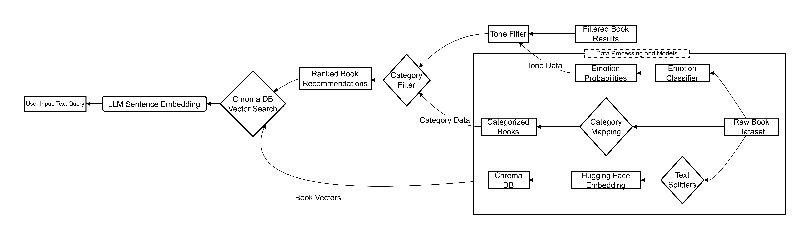

# SemanticReads: A Filtered Book Recommender

A powerful, AI-driven book recommendation engine built with a FastAPI backend and a simple Python-served frontend, featuring semantic search and advanced categorical and emotional filtering.

---

## Overview

Welcome to SemanticReads! This project is a full-stack application designed to enhance book discovery by allowing users to find books based on the meaning of their input (semantic search) and filter those results by category (Fiction/Nonfiction) and tone/emotion (sentiment).

It was built with the goal of making complex information easily searchable and filterable, leveraging state-of-the-art Hugging Face transformer models for both the vector search core and the classification filters.

---

## Core AI Features

This project utilizes a sophisticated three-layer AI pipeline to deliver highly refined recommendations:

- **Semantic Search Core**: Uses vector similarity to find books matching the user's input text (e.g., searching "a story about resilience and hope" returns books with similar themes).

- **Category Filtering**: Filters results into simple buckets like 'Fiction', 'Nonfiction', and "Children's Fiction."

- **Tone/Emotion Filtering**: Allows users to filter books by the dominant emotion expressed in the book's description.

---

## AI/ML Architecture

The core functionality of SemanticReads is powered by the following models and database components:

<p>
  
</p>

### Data Source

The book data was obtained from the [7k Books with Metadata](https://www.kaggle.com/) dataset on Kaggle.

### 1. Vector Database & Embedding

- **Vector Database**: ChromaDB integrated via LangChain.

- **Embedding Model**: `huggingface/sentence-transformers/all-MiniLM-L6-v2`

- **Mechanism**: The model generates high-quality vectors for both the book descriptions (in the database) and the user's query. Book recommendations are generated by comparing the vector similarity between the user query and the database entries.

### 2. Category Classifier (Fiction/Nonfiction)

The raw book categories were simplified into two main types to improve user experience.

- **Model**: `facebook/bart-large-mnli` (Zero-shot classification pipeline).

- **Goal**: Classifies books into two simple categories: Fiction and Nonfiction.

- **Process**:
  - A manual mapping was created for dominant categories (e.g., 'Biography & Autobiography' -> 'Nonfiction').
  - The zero-shot model was then used to classify all remaining uncategorized books against the labels: `['Fiction', 'Nonfiction']`.

- **Accuracy**: The classification achieved approximately 76% accuracy.

### 3. Tone/Emotion Classifier

This feature allows users to filter books by sentiment.

- **Model**: `j-hartmann/emotion-english-distilroberta-base` (Text classification pipeline).

- **Emotions Tracked**: The model predicts the probability for each of the following seven emotions in a book's description: Anger, Disgust, Fear, Joy, Neutral, Sadness, Surprise.

- **Mechanism**: All seven emotion probabilities are stored for each book. Filtering is applied by showing books where the selected emotion has the highest probability score.

---

## Installation

These instructions will get you a copy of the project up and running on your local machine for development and testing purposes.

### Prerequisites

You will need the following installed:

- **Python 3.9+** (Tested with 3.11)

- The `uvicorn` package for the backend server.

It is highly recommended to use a virtual environment (like Conda or standard venv) to manage dependencies.

### Steps

1. **Clone the repository**:

```bash
git clone https://github.com/your-username/semanticreads.git
cd semanticreads
```

2. **Set up the environment and install dependencies**:

#### Option A: Recommended (Using Conda)
If you have Anaconda/Miniconda installed, create a new environment:

```bash
conda create -n semanticreads python=3.11
conda activate semanticreads
pip install -r requirements.txt
```

#### Option B: Standard (Using pip)
If you prefer a standard Python virtual environment:

```bash
python -m venv venv
source venv/bin/activate  # On Windows, use: .\venv\Scripts\activate
pip install -r requirements.txt
```

---

## Usage

The project is run using the command-line utility (CLI) wrapper provided in the repository's root directory. This script starts both the FastAPI backend and the simple HTTP frontend simultaneously.

### Running the Application

To start both the backend and frontend servers:

```bash
python run_servers.py
```

**First Run Notice:**
The very first time you run the application, the system will initiate the creation of the ChromaDB vector store and load the necessary embedding and classification models. This process involves a period of model downloading and database creation and may take a few minutes depending on your system's performance. The CLI output will inform you when this process is complete.

### Access

Once the servers are running, the application will be accessible at:

| Component | URL |
|-----------|-----|
| Frontend UI | http://127.0.0.1:8080 |
| Backend API | http://127.0.0.1:8000 |
| API Docs (Swagger) | http://127.0.0.1:8000/docs |

Press `Ctrl+C` in the terminal to stop both servers gracefully.

---

## License

Distributed under the MIT License. See `LICENSE` for more information.
